**Idioma**: 🇧🇷 <a href="https://github.com/andresilvase/tasky/blob/main/README.md">Português Brasileiro</a> | 🇺🇸 <a href="https://github.com/andresilvase/tasky/blob/main/readme-en-us.md">Inglês Americano</a>

---

#  Tasky - Gerenciador de Tarefas 📝

> "As pessoas organizadas são apenas preguiçosas demais para procurar as coisas" - Albert Einstein (não, ele nunca disse isso 😅)


## 🎯 O Que é o Tasky?
Bem-vindo ao **Tasky**, o aplicativo de tarefas mais organizado e poliglota que você já viu! 🎉

Tasky é aquele amigo organizado que você sempre quis ter! Um app de tarefas que não julga seu caos, apenas tenta organizá-lo de uma forma legal.

Aqui você pode finalmente dar um jeito na bagunça que chama de "meu dia" com estilo e simplicidade. 🚀

<table>  
  <tr>    
    <td>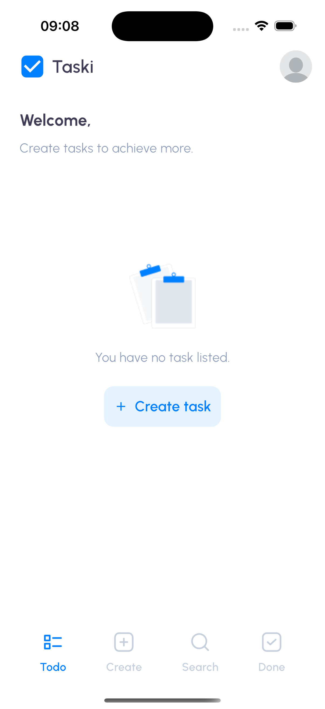</td>     
    <td>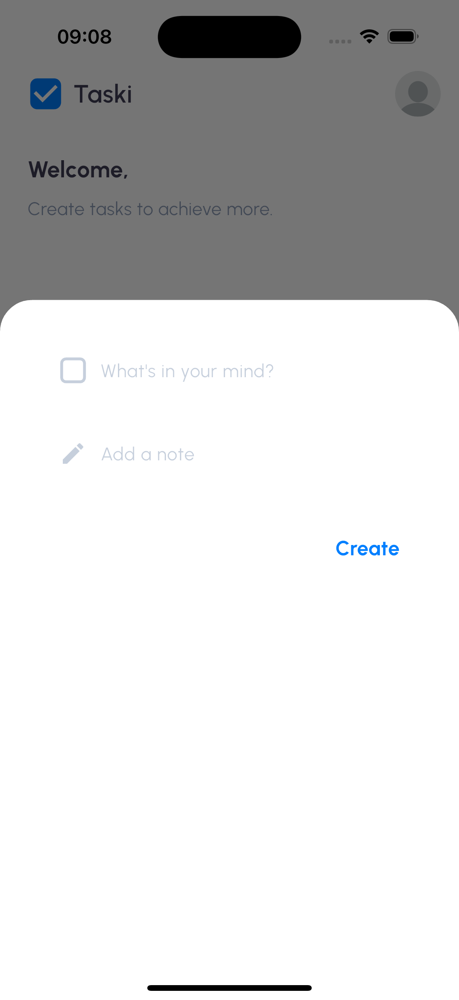</td>     
    <td>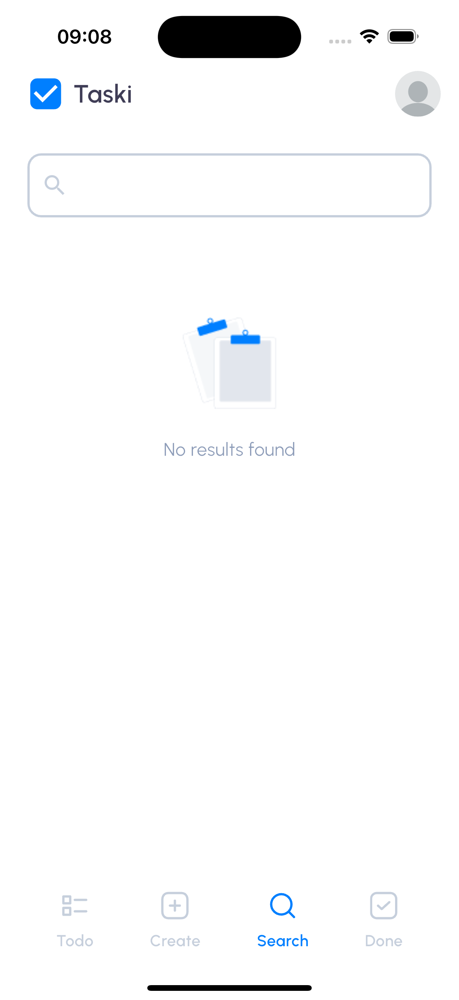</td>     
    <td>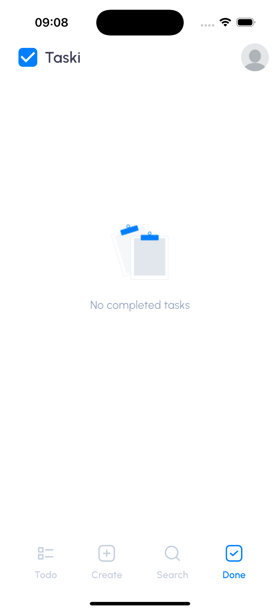</td>                                          
  </tr>  
</table>


<table>  
  <tr>        
    <td>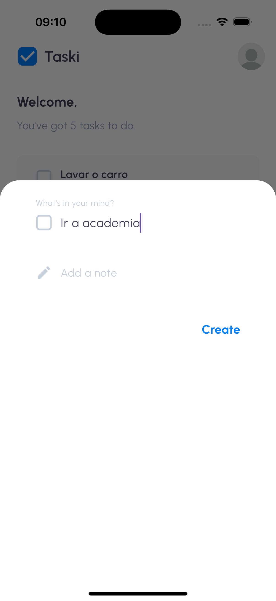</td>   
    <td>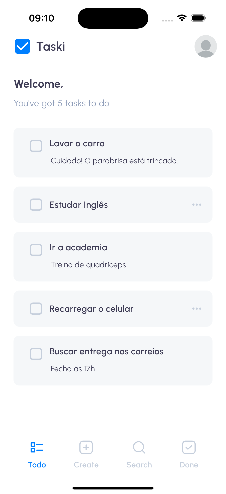</td>        
    <td>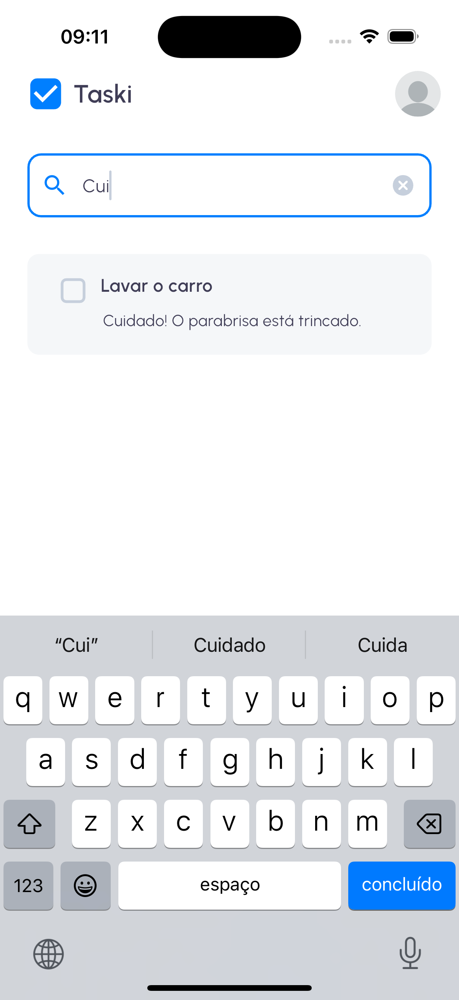</td>   
    <td>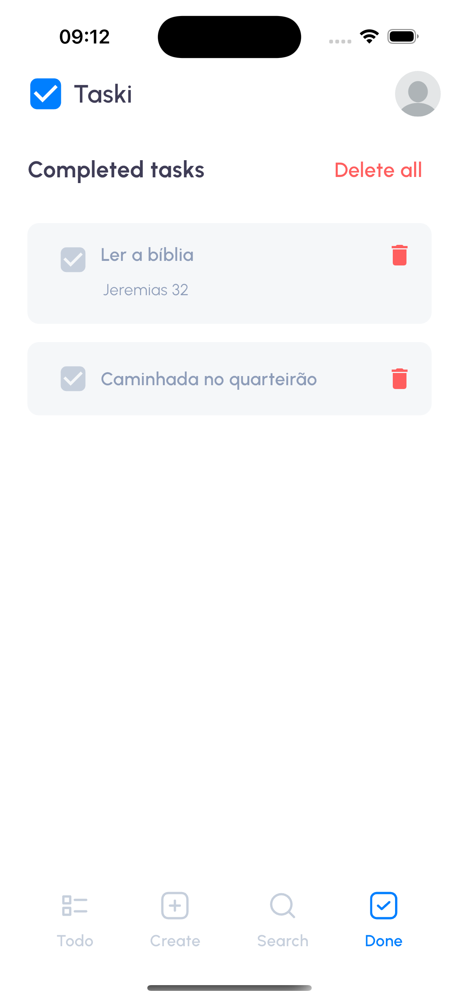</td>           
  </tr>  
</table>

<table>  
  <tr>    
    <td>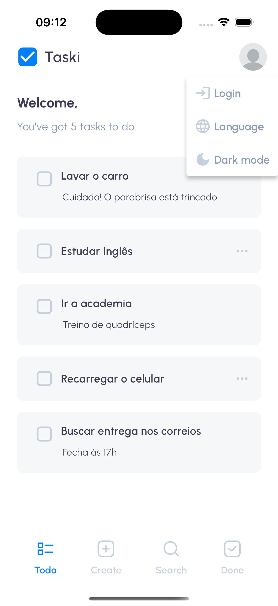</td>       
    <td>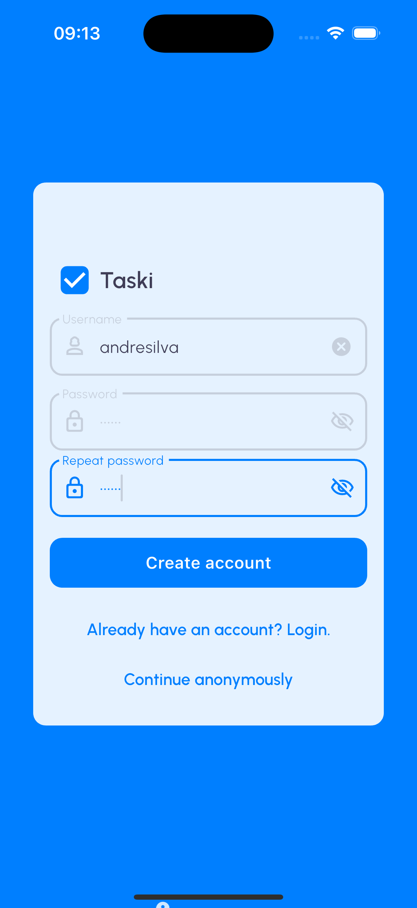</td>                
    <td>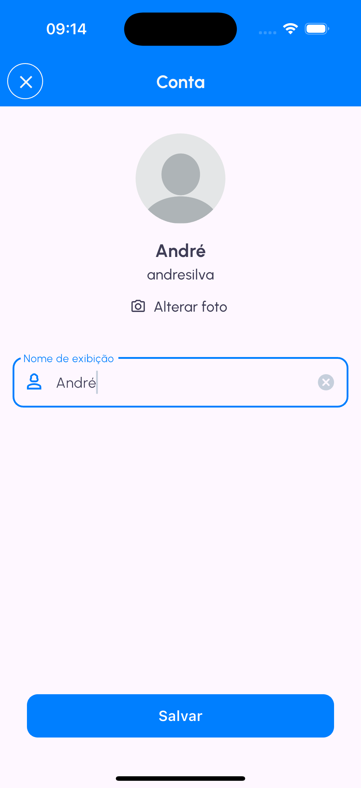</td>    
    <td>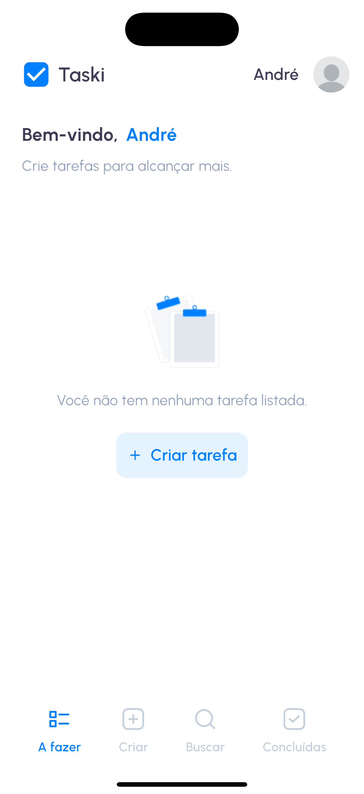</td>                    
  </tr>  
</table>

---
### Offline First! 📶

Internet? Quem precisa dela? O Tasky usa o banco de dados local Hive 🐝, para que suas tarefas estejam sempre com você, mesmo quando o Wi-Fi estiver contra.

---

## 🌟 Sobre o app e funcionalidades Principais

### O Básico (porque ninguém quer complicação):
- **Criar Tarefa:** Adicione um título e uma descrição para a sua tarefa. Simples, direto e sem frescuras!
- **Pesquisar Tarefa:** Procure por título ou descrição. (Não se preocupe, nós não julgamos as palavras-chave absurdas que você digitar.)
- **Completar Tarefa:** Concluiu? Risque da lista e celebre com estilo. 🍾

<table>  
  <tr>
    <td></td>
    <td></td>      
    <td></td>    
  </tr>  
</table>


### Sistema de Autenticação Simples 🔐
- **Modo sem Login:** Use o Tasky no modo "eu não quero me registrar". Todas as tarefas ficam no perfil padrão, perfeito para os minimalistas.
- **Modo com Login:** Faça login, adicione um nome incrível e uma foto de perfil estilosa. Suas tarefas ficam personalizadas e prontas para impressionar!


<table>
  <tr>
    <td></td>
    <td></td>    
    <td></td>    
  </tr>  
</table>

### Dark Mode ☾
Se você é fã de telas escuras ou quer poupar a bateria do celular, o Tasky também tem **Dark Mode**! Organize suas tarefas com estilo, sem queimar as retinas. 

<table> 
  <tr>
    <td>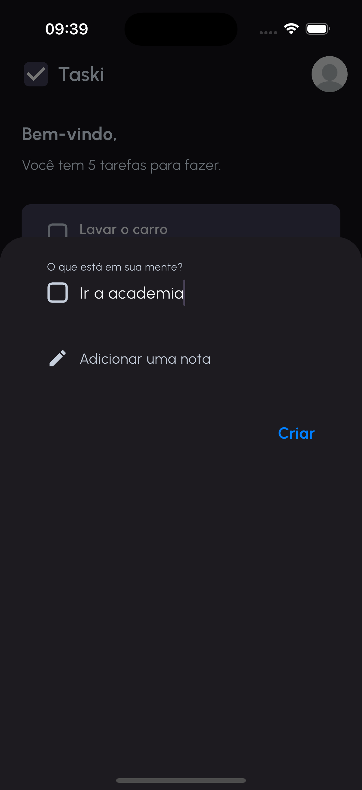</td>    
    <td>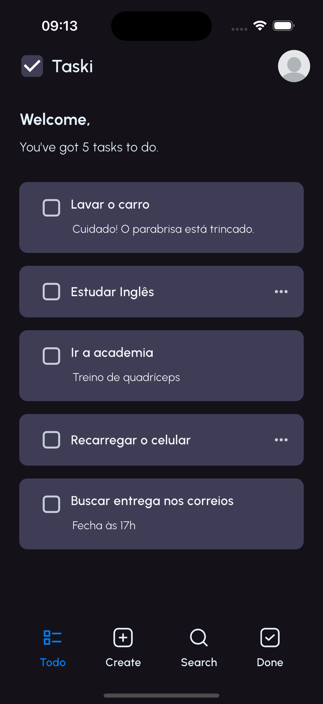</td>
    <td>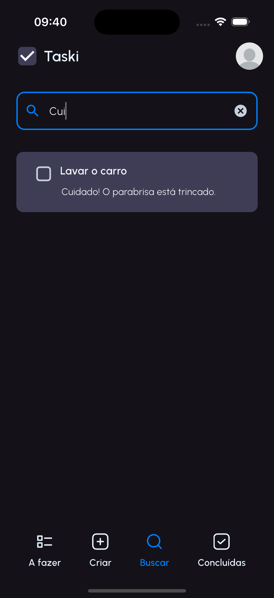</td>    
    <td>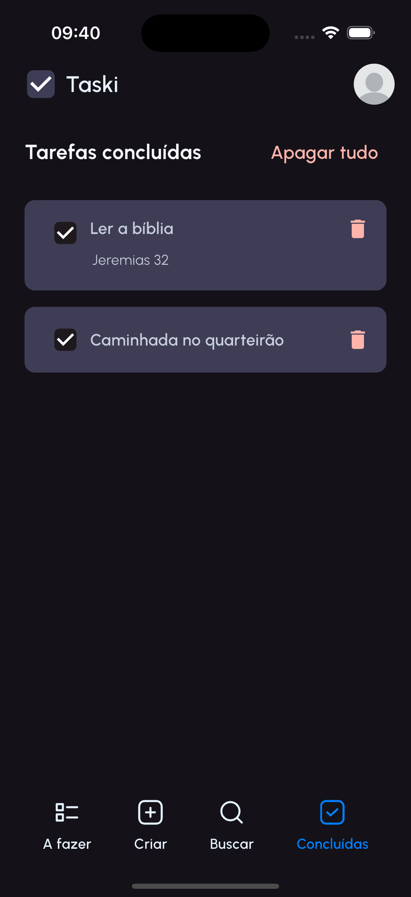</td>    
  </tr>  
</table>

### Multilinguismo à Toda Prova 🌎
O Tasky fala mais idiomas que aquele seu amigo poliglota metido. Disponível em:
- 🇺🇸 Inglês (para os fancy)
- 🇧🇷 Português (pra nós!)
- 🇪🇸 Espanhol (¡Hola!)
- 🇫🇷 Francês (Oui oui)
- 🇮🇹 Italiano (Mamma mia!)
- 🇮🇳 Hindi (नमस्ते)
- 🇨🇳 Chinês (你好)
<table>  
  <tr>
    <td>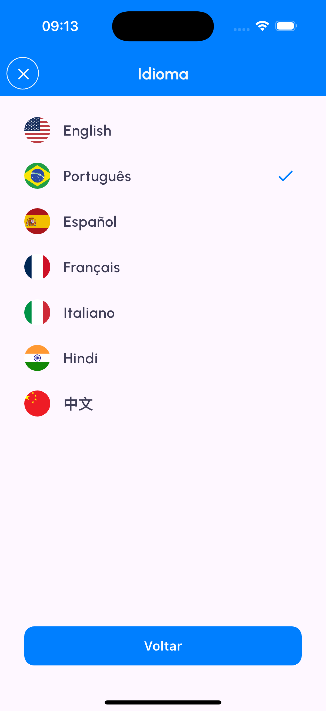</td>
    <td>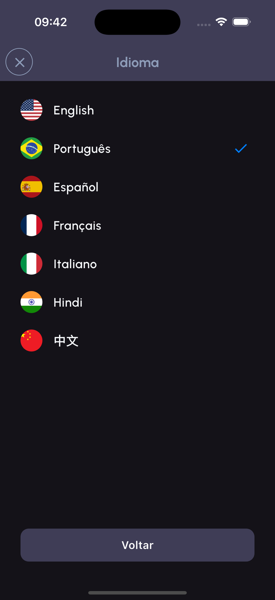</td>    
  </tr>  
</table>

Se a organização mundial não bastar, pelo menos você vai aprender um "hello" em sete línguas! 😉

# 🛠️ Tecnicamente Falando...

Para executar o aplicativo, siga estas etapas:

1. Configure Flutter na sua máquina, se ainda não estiver configurado.
    Acesse [flutter.dev](https://flutter.dev).

2. Clone o repositório:
```bash
git clone https://github.com/andresilvase/tasky.git
```

3. Instale as dependências:
```bash
flutter pub get
```

4. Execute o aplicativo:
```bash
flutter run
```

## 🏗️ Arquitetura MVVM
O aplicativo segue a arquitetura MVVM (Model-View-ViewModel) para uma estrutura de código organizada e escalável.
| Feature Tasks                          | Feature Language                 | Feature Auth                    |
| -------------------------------------- | -------------------------------- | ------------------------------- |
|  |  |  |

## Testes Automatizados 🔬
O aplicativo possui testes automatizados de unidade, interface e integração para garantir a qualidade do código. Para executar os testes, execute o seguinte comando na raiz do projeto:

- Testes de unidade:

```bash
flutter test test/unit_test.dart
```

- Testes de interface:
```bash
flutter test test/widgets_test.dart
```

- Testes de integração:
```bash
flutter test integration_test/app_test.dart
```

## Cobertura de código LCOV 

Utilizando a ferramenta de cobertura de código LCOV,podemos visualizar a porcentagem de cobertura de código do aplicativo.
Para visualizar a cobertura de código, é necessário ter instalado o LCOV. Após instalar o LCOV, execute os seguintes comandos na raiz do projeto:

```bash
flutter test flutter test --coverage
```

```bash
genhtml -o coverage/html coverage/lcov.info
```

```bash
open coverage/html/index.html
```

Após executar os comandos, a cobertura de código será exibida em um navegador.


## CI/CD - Codemagic 
O aplicativo está hospedado no Codemagic, uma plataforma de CI/CD para aplicativos Flutter. O Codemagic é responsável por compilar e implantar o aplicativo em dispositivos iOS e Android.

## 🚀 Tecnologias Utilizadas

O **Tasky** foi construído com um conjunto de tecnologias modernas para oferecer a melhor experiência ao usuário:

- **Flutter**: Framework utilizado para garantir um aplicativo fluido tanto em Android quanto em iOS.
- **Hive**: Banco de dados local para armazenamento de dados.
---

## 🔮 Roadmap Futuro

Veja o que planejamos para as próximas versões:
- [ ] ☁️  Melhorar o sistema de autenticação para ter um servidor remoto.
- [ ] 🔑 Criação de uma conta online.
---

## 📜 Licença
O Tasky está sob a licença [MIT](LICENSE). Use, abuse, modifique e compartilhe. Só não esqueça de mandar aquele "obrigado" maroto. 😎

## 🌍 Links Importantes

- [Baixe o Tasky na Play Store]()
- [Baixe o Tasky na Apple Store]()
- [Acesse o site oficial]()
- [Visite o repositório no GitHub](https://github.com/andrese/tasky)

---

## 🤝 Como Contribuir

Contribuições são bem-vindas! Se você deseja ajudar no desenvolvimento do **Tasky**, siga os passos abaixo:

1. Faça um **fork** do repositório.
2. Crie uma **branch** para suas modificações.
3. Envie um **Pull Request** com suas sugestões.

Vamos construir juntos uma plataforma que ajude mais animais a encontrar seus lares para sempre!

## ⬇ Baixe agora

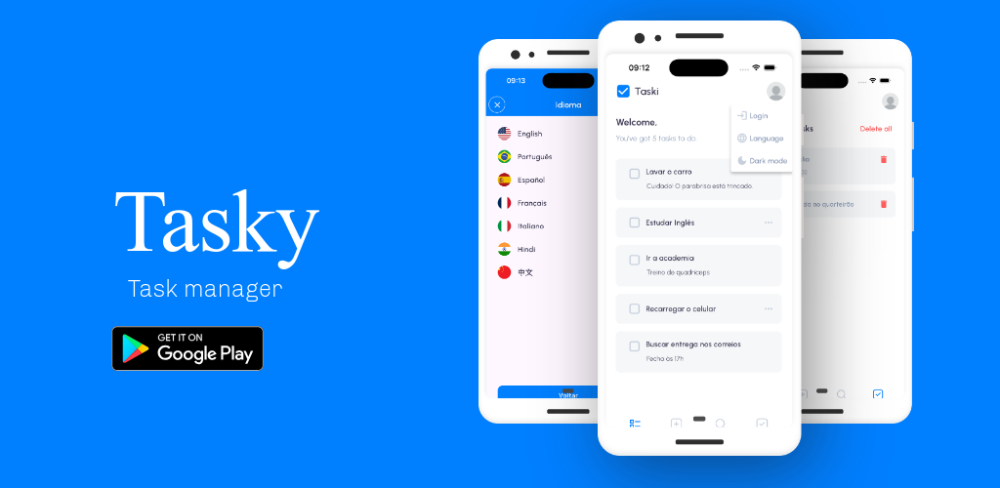

<p>
  <a href="https://play.google.com/store/apps/details?id=br.com.anjasolutions.tasky">
    
  </a>

  <a href="">
    
  </a>
</p>

Feito com ❤️, café ☕ e algumas noites mal dormidas pelo seu desenvolvedor favorito. Baixe o Tasky e organize-se já (ou pelo menos finja que vai)! 😅
