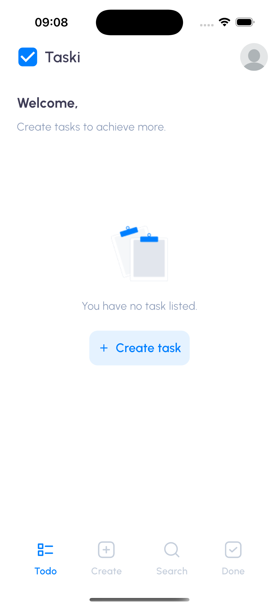
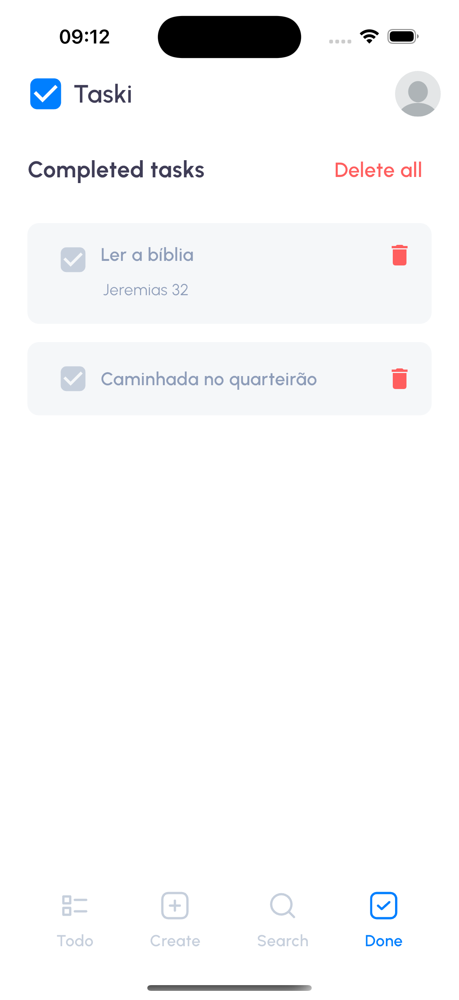
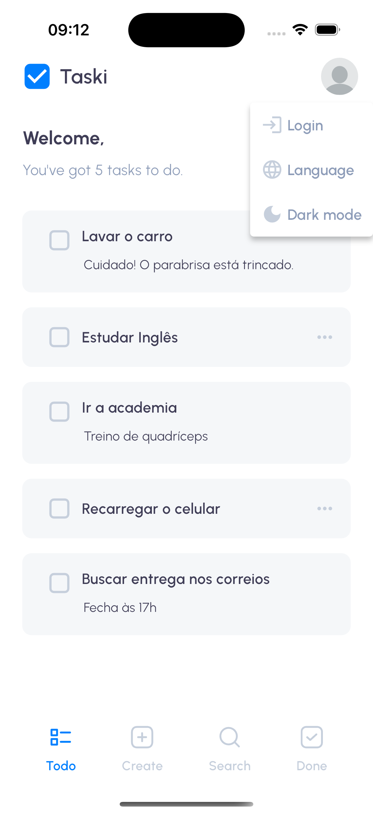
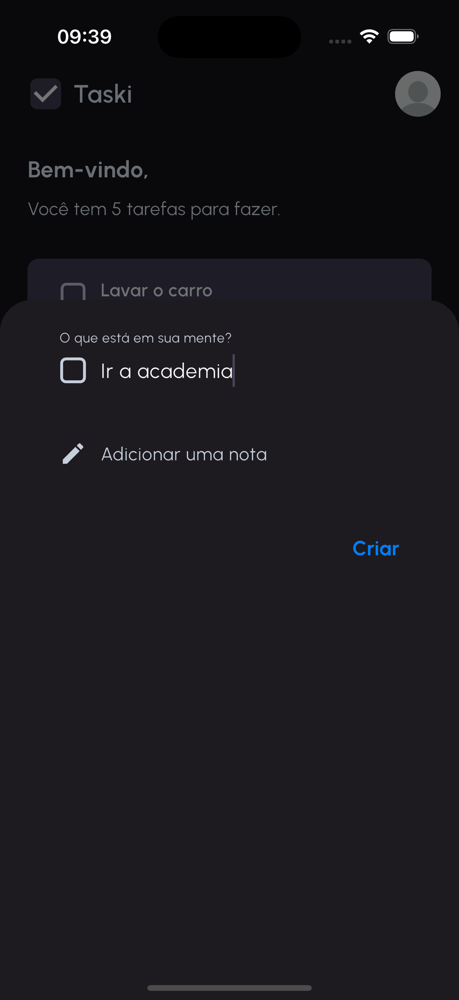
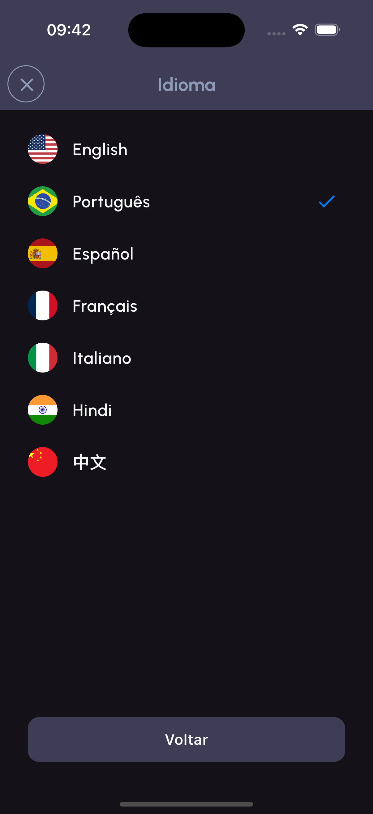
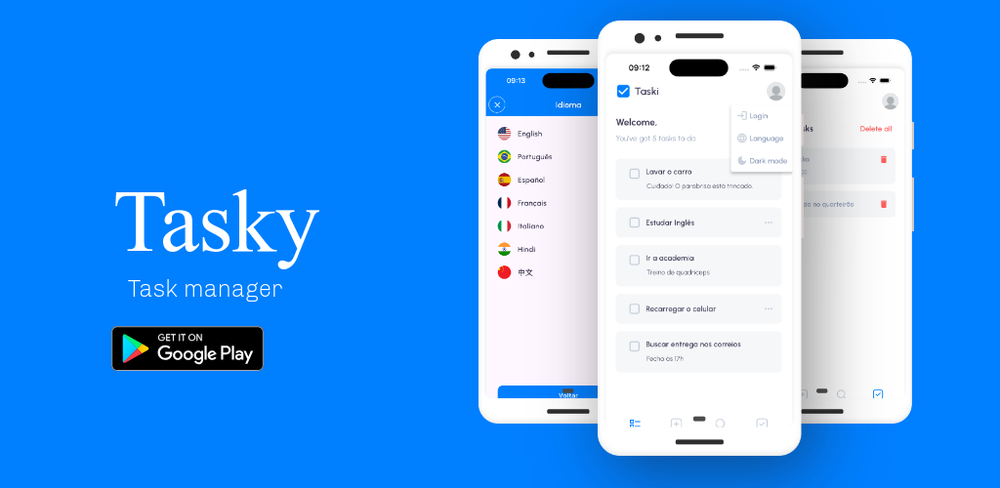

**Language**: 🇺🇸 <a href="https://github.com/andresilvase/tasky/blob/main/readme-en-us.md">American English</a> | 🇧🇷 <a href="https://github.com/andresilvase/tasky/blob/main/README.md">Brazilian Portuguese</a>

---

#  Tasky - Task Manager 📝

> "Organized people are just too lazy to look for things" - Albert Einstein (no, he never said that 😅)


## 🎯 What is Tasky?

Welcome to **Tasky**, the most organized and multilingual task app you've ever seen! 🎉

Tasky is that organized friend you've always wanted! A task app that doesn't judge your chaos, it just tries to organize it in a cool way. 

Here you can finally get your so-called "my day" mess in order with style and simplicity. 🚀

<table>  
  <tr>    
    <td></td>     
    <td></td>     
    <td></td>     
    <td></td>                                          
  </tr>  
</table>


<table>  
  <tr>        
    <td></td>   
    <td></td>        
    <td></td>   
    <td></td>           
  </tr>  
</table>

<table>  
  <tr>    
    <td></td>       
    <td></td>                
    <td></td>    
    <td></td>                    
  </tr>  
</table>

---
### Offline First! 📶

Internet? Who needs it? Tasky uses the Hive local database 🐝, so your tasks are always with you, even when Wi-Fi is against you.

---

## 🌟 About the App and Main Features

### The Basics (because nobody wants complications):
- **Create Task:** Add a title and description for your task. Simple, straightforward, and no fuss!
- **Search Task:** Search by title or description. (Don't worry, we don't judge the absurd keywords you type.)
- **Complete Task:** Done? Cross it off the list and celebrate in style. 🍾

<table>  
  <tr>
    <td></td>
    <td></td>      
    <td></td>    
  </tr>  
</table>


### Simple Authentication System 🔐
- **No Login Mode:** Use Tasky in "I don't want to register" mode. All tasks stay in the default profile, perfect for minimalists.
- **Login Mode:** Log in, add an awesome name and a stylish profile picture. Your tasks become personalized and ready to impress!

<table>
  <tr>
    <td></td>
    <td></td>    
    <td></td>    
  </tr>  
</table>

### Dark Mode ☾
If you're a fan of dark screens or want to save your phone's battery, Tasky also has **Dark Mode**! Organize your tasks in style, without burning your retinas.

<table>
  <tr>
    <td></td>    
    <td></td>
    <td></td>    
    <td></td>    
  </tr>  
</table>

### Multilingualism at Its Best 🌎
Tasky speaks more languages than that pretentious polyglot friend of yours. Available in:
- 🇺🇸 English (for the fancy ones)
- 🇧🇷 Portuguese (for us!)
- 🇪🇸 Spanish (¡Hola!)
- 🇫🇷 French (Oui oui)
- 🇮🇹 Italian (Mamma mia!)
- 🇮🇳 Hindi (नमस्ते)
- 🇨🇳 Chinese (你好)
<table>  
  <tr>
    <td></td>
    <td></td>    
  </tr>  
</table>

If global organization isn't enough, at least you'll learn how to say "hello" in seven languages! 😉

# 🛠️ Technically Speaking...

To run the application, follow these steps:

1. Set up Flutter on your machine if it's not already configured.
    Visit [flutter.dev](https://flutter.dev).

2. Clone the repository:
```bash
git clone https://github.com/andresilvase/tasky.git
```

3. Install dependencies:
```bash
flutter pub get
```

4. Run the app:
```bash
flutter run
```

## 🏗️ MVVM Architecture
The app follows the MVVM (Model-View-ViewModel) architecture for an organized and scalable code structure.
| Feature Tasks                            | Feature Language                  | Feature Auth                    |
| ---------------------------------------- | --------------------------------- | ------------------------------- |
|  |  |  |

## Automated Tests 🔬
The app has automated unit, interface, and integration tests to ensure code quality. To run the tests, execute the following command in the project root:

- Unit tests:
```bash
flutter test test/unit_test.dart
```

- Interface tests:
```bash
flutter test test/widgets_test.dart
```

- Integration tests:
```bash
flutter test integration_test/app_test.dart
```

## LCOV Code Coverage 
Using the LCOV code coverage tool, we can visualize the app's code coverage percentage.
To view code coverage, you need to have LCOV installed. After installing LCOV, run the following commands in the project root:

```bash
flutter test flutter test --coverage
```

```bash
genhtml -o coverage/html coverage/lcov.info
```

```bash
open coverage/html/index.html
```

After running the commands, code coverage will be displayed in a browser.


## CI/CD - Codemagic 
The app is hosted on Codemagic, a CI/CD platform for Flutter apps. Codemagic is responsible for building and deploying the app to iOS and Android devices.


## 🚀 Technologies Used

**Tasky** was built with a set of modern technologies to offer the best user experience:

- **Flutter**: Framework used to ensure a fluid app on both Android and iOS.
- **Hive**: Local database for data storage.
---

## 🔮 Future Roadmap

See what we have planned for upcoming versions:
- [ ] ☁️ Improve the authentication system to have a remote server.
- [ ] 🔑 Online account creation.
---

## 📜 License
Tasky is under the [MIT](LICENSE) license. Use, modify, and share it. Just don't forget to send that cool "thank you". 😎

## 🌍 Important Links

- [Download Tasky on Play Store]()
- [Download Tasky on Apple Store]()
- [Visit the official website]()
- [Visit the GitHub repository](https://github.com/andrese/tasky)

---

## 🤝 How to Contribute

Contributions are welcome! If you want to help develop **Tasky**, follow the steps below:

1. **Fork** the repository.
2. Create a **branch** for your modifications.
3. Send a **Pull Request** with your suggestions.

Let's build together a platform that helps more animals find their forever homes!

## ⬇ Download Now



<p>
  <a href="https://play.google.com/store/apps/details?id=br.com.anjasolutions.tasky">
    
  </a>

  <a href="">
    
  </a>
</p>

Made with ❤️, coffee ☕ and some sleepless nights by your favorite developer. Download Tasky and get organized now (or at least pretend you will)! 😅
