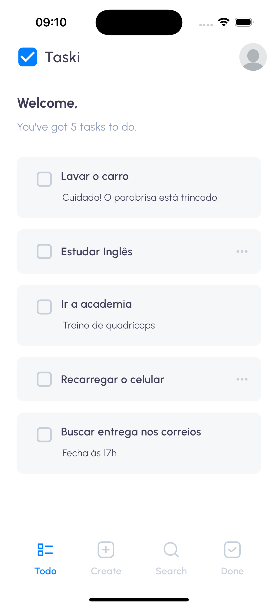
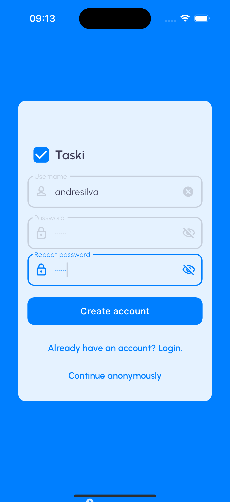
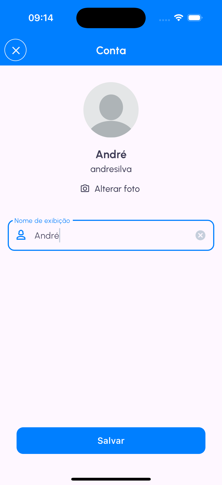
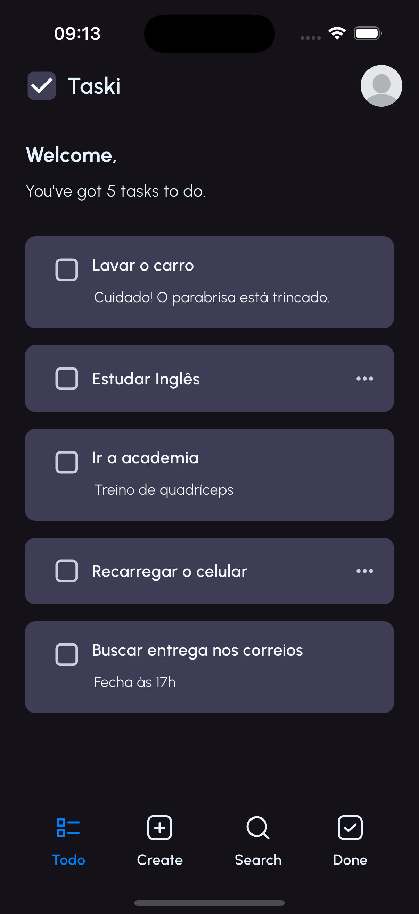
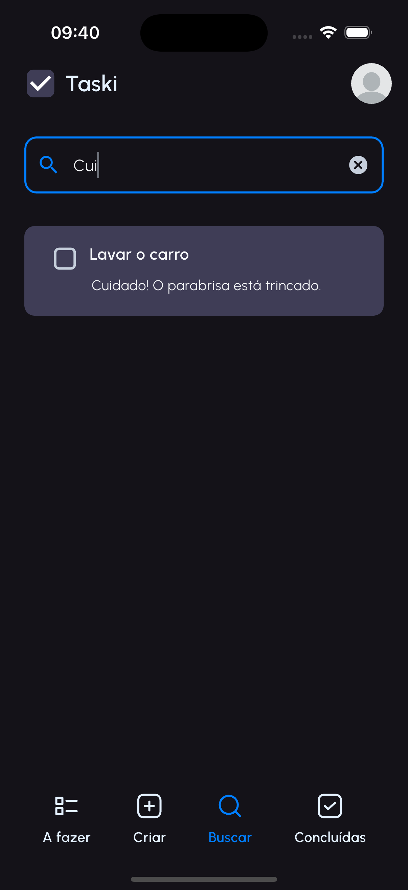
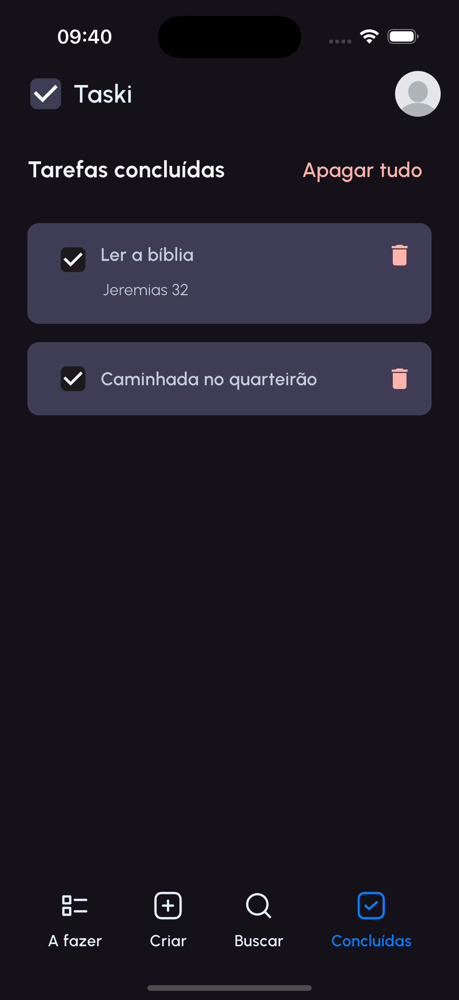

**Language**: 🇧🇷 <a href="https://github.com/andresilva/tasky/blob/main/readme.md">Brazilian Portuguese</a> | 🇺🇸 <a href="https://github.com/andresilva/tasky/blob/main/readme-en-us.md">American English</a>

---

#  Tasky - Task Manager 📝

Welcome to **Tasky**, the most organized and multilingual task app you've ever seen! 🎉

Here you can finally fix the mess you call "my day" with style and simplicity. 🚀

<table>  
  <tr>    
    <td></td>     
    <td></td>     
    <td></td>     
    <td></td>                                          
  </tr>  
</table>

<table>  
  <tr>        
    <td></td>   
    <td></td>        
    <td></td>   
    <td></td>           
  </tr>  
</table>

<table>  
  <tr>    
    <td></td>       
    <td></td>                
    <td></td>    
    <td></td>                    
  </tr>  
</table>

## 🛠️ How to Set Up and Run
To run the app, follow these steps:

1. Set up Flutter on your machine if not already configured.  
   Visit [flutter.dev](https://flutter.dev).

2. Clone the repository:
```bash
git clone https://github.com/andresilva/tasky.git
```

3. Install dependencies:
```bash
flutter pub get
```

4. Run the app:
```bash
flutter run
```

---
### Offline First! 📶

Internet? Who needs it? Tasky uses the Hive local database 🐝, so your tasks are always with you, even when Wi-Fi isn't.

---
## 🏗️ MVVM Architecture
The app follows the MVVM (Model-View-ViewModel) architecture for an organized and scalable code structure.  
| Feature Tasks                            | Feature Language                  | Feature Auth                    |
| ---------------------------------------- | --------------------------------- | ------------------------------- |
|  |  |  |

## 🏗️ Automated Testing
The app includes unit, widget, and integration tests to ensure code quality. To run the tests, execute the following command in the project root:

- Unit tests:
```bash
flutter test test/unit_test.dart
```

- Widget tests:
```bash
flutter test test/widgets_test.dart
```

- Integration tests:
```bash
flutter test integration_test/app_test.dart
```

## LCOV Code Coverage: 95.4%
Using the LCOV code coverage tool, we can view the app's code coverage percentage. After installing LCOV, run the following commands in the project root:

```bash
flutter test --coverage
```

```bash
genhtml -o coverage/html coverage/lcov.info
```

```bash
open coverage/html/index.html
```

After executing the commands, the code coverage will be displayed in your browser.


---

## 🌟 About the App and Main Features

### The Basics (because no one likes complications):
- **Create Task:** Add a title and description for your task. Simple, direct, and no fuss!
- **Search Task:** Look for tasks by title or description. (Don't worry, we won't judge your absurd keywords.)
- **Complete Task:** Done? Mark it off the list and celebrate in style. 🍾

<table>  
  <tr>
    <td></td>
    <td></td>      
    <td></td>    
  </tr>  
</table>

### Simple Authentication System 🔐
- **No Login Mode:** Use Tasky in "I don't want to register" mode. All tasks stay in the default profile, perfect for minimalists.
- **Login Mode:** Log in, add an amazing name, and a stylish profile picture. Your tasks are personalized and ready to impress!

<table>
  <tr>
    <td></td>
    <td></td>    
    <td></td>    
  </tr>  
</table>

### Dark Mode ☾
Love dark screens or want to save phone battery? Tasky also has **Dark Mode**! Organize your tasks in style without straining your eyes.  

<table>
  <tr>
    <td></td>    
    <td></td>
    <td></td>    
    <td></td>    
  </tr>  
</table>

---

## 🌍 Multilingual Support
Tasky speaks more languages than your show-off polyglot friend.  

<table>  
  <tr>
    <td></td>
    <td></td>    
  </tr>  
</table>